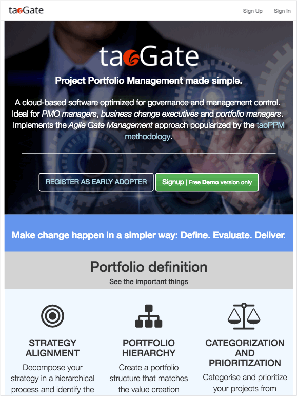
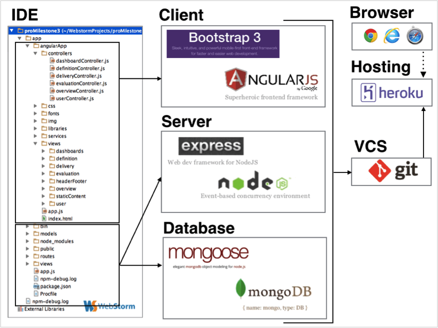
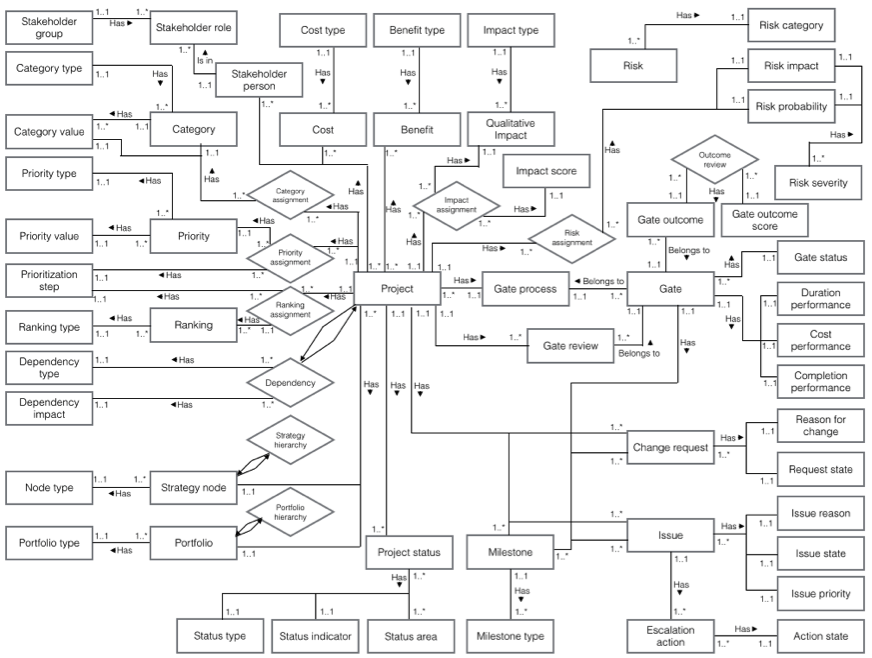
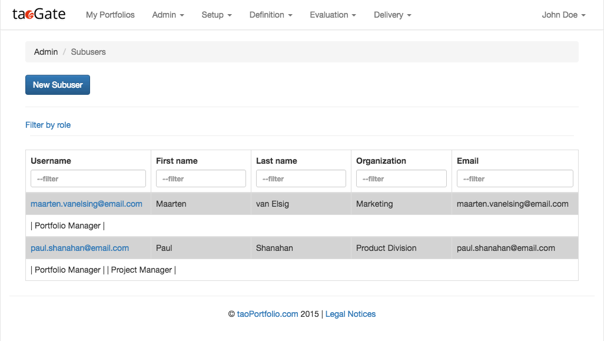
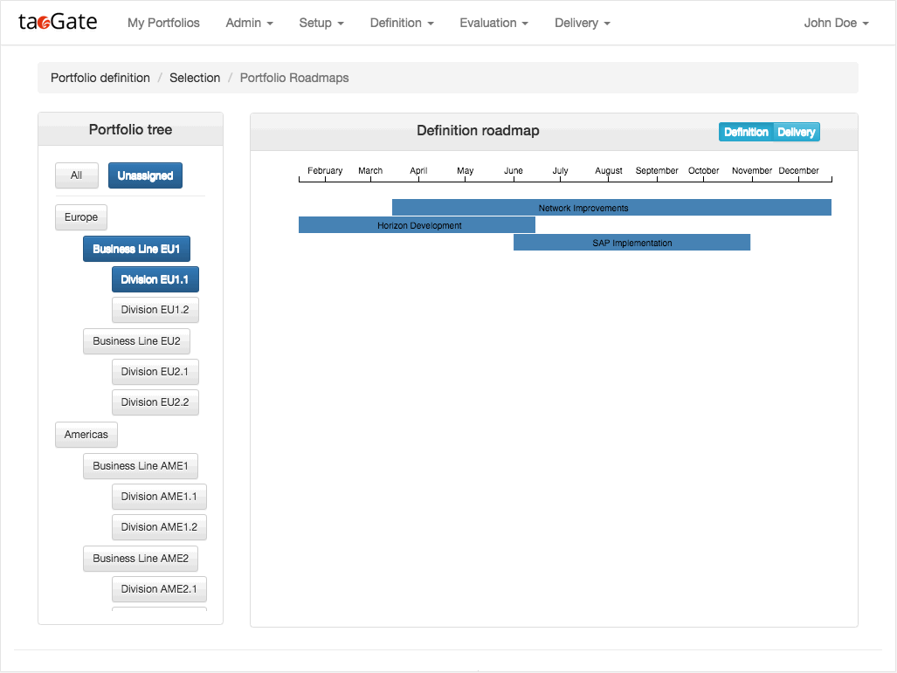
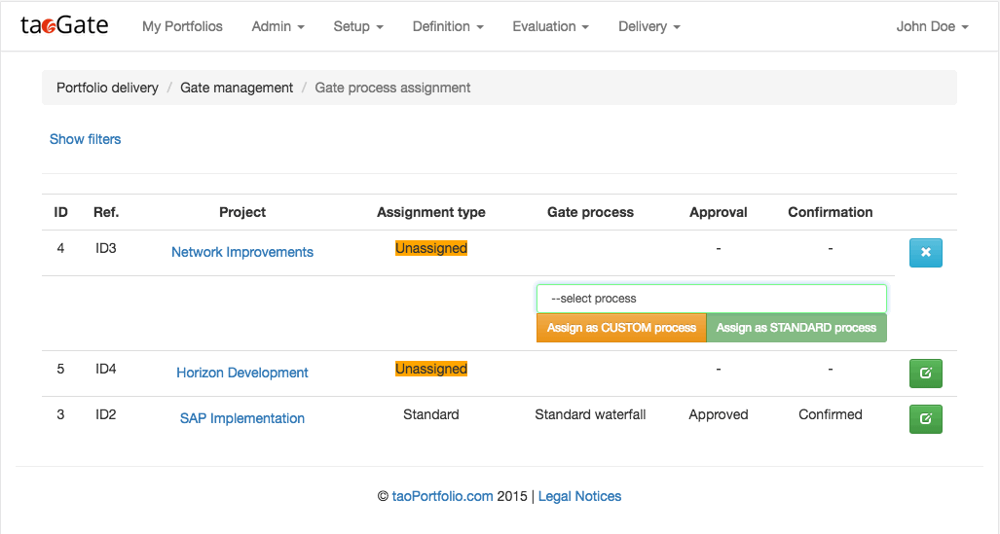
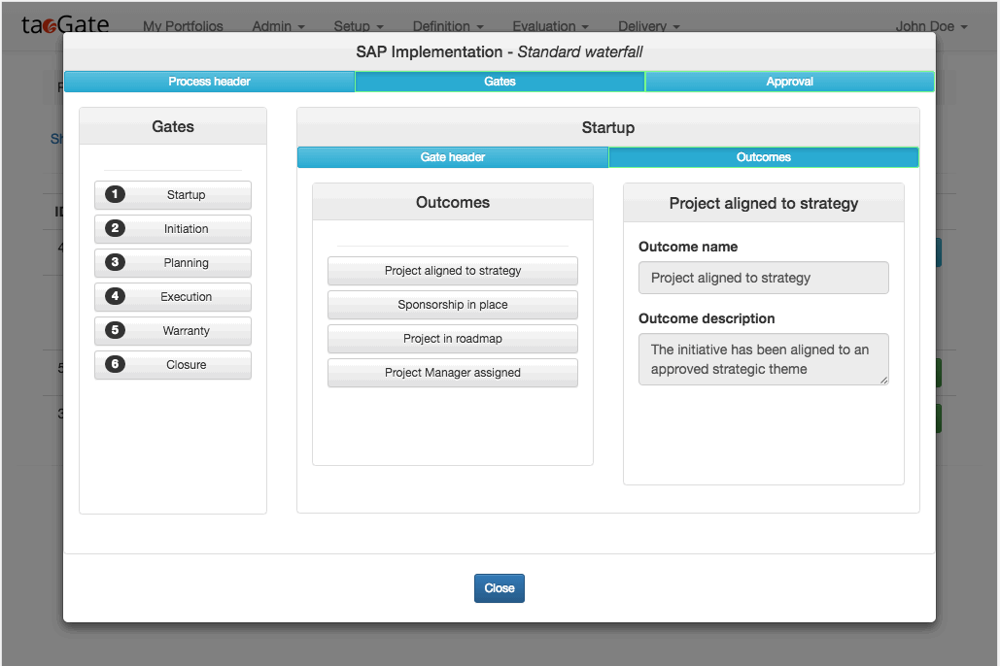
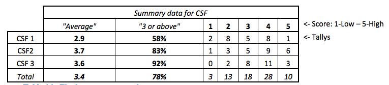
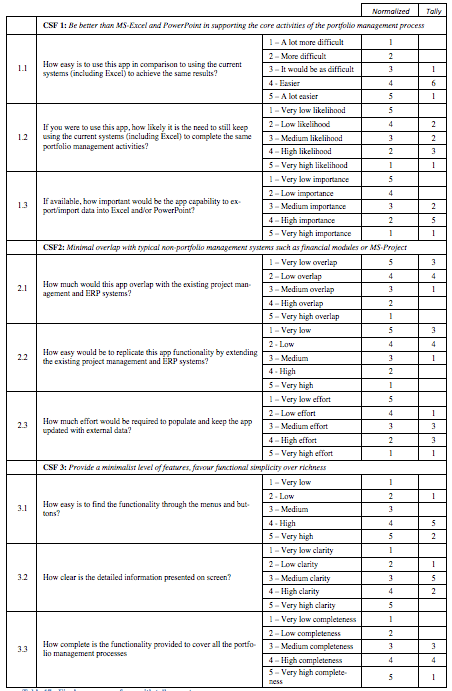

Single Page Web Application to support the project portfolio management process in agile organizations.
The app marries agility with good gate governance, making the job of PMO Managers,
Business Change Executives and Portfolio Managers simpler and more efficient.



App demo is live at [taoGate.co](http://www.taogate.co)

Built with the [MEAN.JS framework](http://meanjs.org):

* MongoDB - [MongoDB Official Website](http://mongodb.org/)
* Express - [Official Website](http://expressjs.com/)
* AngularJS - [Official Website](http://angularjs.org/)
* Node.js - [Node.js Official Website](http://nodejs.org/)

Additional libraries and modules included:

* [AsyncJS](http://caolan.github.io/async/)
* [D3.js](https://d3js.org)
* [Lodash](https://lodash.com)
* [mongoose-multitenant](https://www.npmjs.com/package/mongoose-multitenant)

## Key features

* PORTFOLIO DEFINITION
  * Identification
  * Stakeholders & project organization
  * Dependencies
  * Categorization
  * Prioritization

* PORTFOLIO EVALUATION
  * Financial analysis
  * Qualitative analysis
  * Risk analysis
  * Selection status

* PORTFOLIO DELIVERY
  * Gate management process
  * Gate reviews
  * Delivery logs
  * Delivery status

* USER MANAGEMENT & MULTI-TENANCY

## Tools overview

Continuous deployment to Heroku through Github using Grunt for the building process (key tasks: test, minification, obfuscation). 
Developed using Webstorm IDE and Git VCS.



## Database conceptual model
_excerpt only_



## Code examples - BACK-END

####Multi-tenancy



Each new user that signs up is given a `tenantId` that is created from his Mongo _id. 
The role is by default set to `superAdmin`. This user will then be able to
create new user in the `User` collection as sub-users for his organizations. 
This is achieved by giving to all its new subusers the same `tenantId`.
```javascript
// New user signup
exports.signup = function(req, res) {

    // ...
    
    // Set tenant and superAdmin flag
    user.tenantId = 'tid' + user._id.toString();
    user.isSuperAdmin = true;
    user.roles = ['superAdmin'];
    
    // ...
}

// Create sub-user
exports.create = function(req, res) {
	var user = new User(req.body);
	user.user = req.user;
	// ...
	// Set tenant and superAdmin flag
	user.tenantId = req.user.tenantId;
	user.isSuperAdmin = false;
	// ...
}
```

Mongoose-multitenant is then configured to separate collections using the
`tenantId` and allow access only to users belonging to that tenant.
```javascript
var Portfolio = mongoose.mtModel(user.tenantId + '.' + 'Portfolio');
```

In future, the tenantId should be hashed properly and not saved
in the clear (e.g using bcrypt and salt).

####Asynchronous programming with Async

```
exports.updateImpactAssignment = function(req, res) {
    var project = req.project ;
    project.user = req.user;
    project.created = Date.now();

    async.each(project.qualitativeAnalysis, function(assignedGroup, callback) {
        if(assignedGroup._id.equals(req.params.assignedGroupId)){
            async.each(assignedGroup.impacts, function(assignedImpact, callback){
                if(assignedImpact._id.equals(req.params.assignedImpactId)){
                    assignedImpact.score = req.body.scoreId;
                    project.save(function(err){
                        if(err){callback(err);}
                    });
                }
                callback();
            });
        }
        callback();
    }, function(err){
        if( err ) {
            return res.status(400).send({
                message: errorHandler.getErrorMessage(err)
            });
        } else {
            res.jsonp(project);
        }
    });

};
```
####Functional programming with Lodash

```javascript
// ...
function(financialData, callback) {
    // ...
    var aggregatedBenefits = _.chain(financialData[0])
        .sortBy('year')
        .groupBy('year')// {'2015' : [{benefit}, ..], '2016' : [{benefit}, ..]}
        .map(function(v, k){
            return {
                year : k,
                yearlyBenefit : _.reduce(v, function(sum, benefit){
                    return sum + benefit.amount;
                }, 0),
                yearlyCost : 0
            };
        })
        .value();
    // ...
    }
```

####Mongoose middleware hooks

```javascript
// Calculate "changes" in performances at every save

ProjectSchema.pre('save', function (next) {
    var millisecondsPerDay = 1000 * 60 * 60 * 24;
    if(this.process && this.process.gates){
        _.each(this.process.gates, function(gate){

            // Gate Reviews

            _.each(gate.gateReviews, function(document){

                if(document.budgetReview.currentAmount && document.budgetReview.newAmount){
                    document.budgetReview.budgetChange = document.budgetReview.newAmount - document.budgetReview.currentAmount;
                }

                _.each(document.performances.duration.baselineDurationReviews, function(review){
                    if(review.newDate && review.baselineDuration.currentRecord.gateDate){
                        review.dateChange = (review.newDate - review.baselineDuration.currentRecord.gateDate) / millisecondsPerDay;
                    }
                });
                // ...
            });
        //...
        });
    }
    // ...
})
```
####MongoDB Aggregation Framework

```javascript
Project.aggregate([
    {'$unwind': '$categorization'},
    {'$unwind' : '$categorization.categories'},
    {'$group' : {
        _id : {
            categoryValue : '$categorization.categories.categoryValue',
            category :'$categorization.categories.category',
            group : '$categorization.group'
        },
        countCategoryValue : {'$sum': 1},
        fundsCategoryValue : {'$sum' : '$identification.earmarkedFunds'}
    }},
    {'$group' : {
        _id : {
            category :'$_id.category',
            group : '$_id.group'
        },
        categoryValues : {'$push' : {categoryValue : '$_id.categoryValue', countCategoryValue : '$countCategoryValue', fundsCategoryValue : '$fundsCategoryValue'}},
        countCategory : {'$sum': 1}
    }},
    {'$group' : {
        _id : {
            group : '$_id.group'
        },
        categories : {'$push' : {category : '$_id.category', countCategory : '$countCategory', categoryValues : '$categoryValues'}},
        countGroup : {'$sum': 1}
    }},
    {'$project' : {
        group : '$_id.group',
        categories : '$categories',
        countGroup : '$countGroup'
    }}
], function (err, result) {
    if (err) {
        return callback(err);
    } else {
        callback(null, result);
    }
});
```
####Sever-side routing and authorization

Each entity's routes are collected in a separate routing file. Routes as RESTful..ish
and accept authorization middleware
```
app.route('/portfolios/:portfolioId')
    .get(users.requiresLogin, portfolios.read)
    .put(users.requiresLogin, portfolios.hasEditAuthorization, portfolios.update)
    .delete(users.requiresLogin, portfolios.hasEditAuthorization, portfolios.delete);
```
The authorization middleware checks both users' roles and/or the state of the target entity (as applicable)
```javascript
exports.hasEditAuthorization = function(req, res, next) {

    var userIsPortfolioManager, userIsBackupPortfolioManager, userIsSuperhero;
    
    if(req.portfolio.portfolioManager){
        userIsPortfolioManager = req.portfolio.portfolioManager.equals(req.user._id);
    }
    
    if(req.portfolio.backupPortfolioManager){
        userIsBackupPortfolioManager = req.portfolio.backupPortfolioManager.equals(req.user._id);
    }
    
    userIsSuperhero = !!_.find(req.user.roles, function(role) {
        return (role === 'superAdmin' || role === 'admin' || role === 'pmo');
    });
    
    if(!(userIsPortfolioManager || userIsBackupPortfolioManager || userIsSuperhero)){
        return res.status(403).send({
            message: 'User is not authorized'
        });
    }
    
    next();
};
```

##Code examples - FRONT-END

**Use of Angular's promises ($q)**

```javascript
var d = $q.defer();
d.resolve(Authentication);

d.promise.then(function(data){
    var obj = _.clone(data);
    $scope.userHasAuthorization = _.some(obj.user.roles, function(role){
        return role === 'superAdmin' || role === 'admin' || role === 'pmo';
    });
});
```
**Angular custom directive for D3.js bar-chart**



```javascript
angular.module('core').directive('roadmap', ['d3', '_', '$parse',
    function(d3, _, $parse) {
        return {
            restrict: 'EA',
            // scope:{
            //     data : '=data',
            //     selectProject : '=selectProject'
            // },
            link: function(scope, element, attrs){

                var parseData = $parse(attrs.data);
                var parseSelectProject = $parse(attrs.selectProject);

                var selectProject = parseSelectProject(scope);
                var data = parseData(scope);

                var baseColorRectDelivery = '#d3d3d3';

                var margin = {top: 20, right: 20, left: 20},
                    width = 710 - margin.left - margin.right,
                    barHeight = 20;

                var x, xAxis, setChartParameters,
                    onMouseover, onMouseout, onClick,
                    drawChart, redrawChart;

                scope.$watchCollection(parseData, function(newVal, oldVal){
                    if(newVal !== oldVal){
                        data = newVal;
                        redrawChart();
                    }
                });

                setChartParameters = function(){

                    var minAbsolute = d3.min(data, function(d){if(d.identification.reqStartDate){return new Date(d.identification.reqStartDate);}});
                    var maxAbsolute = d3.max(data, function(d){if(d.identification.reqEndDate){return new Date(d.identification.reqEndDate);}});

                    x = d3.time.scale()
                        .domain([minAbsolute, maxAbsolute])
                        .range([0, width-(1.5*margin.left + 1.5*margin.right)]);

                    xAxis = d3.svg.axis()
                        .scale(x)
                        .orient('top');

                };

                onMouseover = function(that, d){
                    d3.select(that).style('cursor', 'pointer');
                };

                onMouseout = function(that, d){
                    d3.select(that).style('cursor', 'auto');
                };

                onClick = function(that, d){
                    selectProject(d);
                };

                d3.select(element[0]).append('svg').attr('id', 'svgDefinition');

                drawChart = function(){

                    setChartParameters();

                    var chart = d3.select('#svgDefinition')
                        .attr('width', width)
                        .attr('height', (barHeight * data.length) + 2 * margin.top)
                        .append('g')
                        .attr('id', 'chartDefinition')
                        .attr('transform', 'translate(' + margin.left + ',' + margin.top + ')');

                    chart.append('g')
                        .attr('class', 'x axis')
                        .call(xAxis)
                        .attr('transform', 'translate(' + margin.left + ',' + 0 + ')');

                    var bar = chart.selectAll('.barDefinition')
                        .data(data, function(d){
                            return d._id;
                        })
                        .enter().append('g')
                        .attr('class', 'barDefinition')
                        .attr('transform', function(d, i) { return 'translate('+ (x(new Date(d.identification.reqStartDate)) + margin.left) +',' + ((i * barHeight) + margin.top) + ')'; });

                    bar.append('rect')
                        .attr('class', 'rectDefinition')
                        .attr('width', function(d){ return x(new Date(d.identification.reqEndDate)) - x(new Date(d.identification.reqStartDate));})
                        .attr('height', barHeight - 1)
                        .on('mouseover', function(d) { onMouseover(this, d); })
                        .on('mouseout', function(d) { onMouseout(this, d); })
                        .on('click', function(d){ onClick(this, d); });

                    bar.append('text')
                        .attr('x', function(d) { return (x(new Date(d.identification.reqEndDate)) - x(new Date(d.identification.reqStartDate)))/3; })
                        .attr('y', barHeight / 2)
                        .attr('dy', '.35em')
                        .text(function(d) { return d.identification.name; })
                        .on('mouseover', function(d) { onMouseover(this, d); })
                        .on('mouseout', function(d) { onMouseout(this, d); })
                        .on('click', function(d){ onClick(this, d); });

                };

                redrawChart = function(){

                    setChartParameters();

                    var svg = d3.select('#svgDefinition')
                        .attr('height', (barHeight * data.length) + 2 * margin.top);

                    var chart = svg.select('#chartDefinition');

                    chart.select('.x.axis')
                        .call(xAxis);

                    // Bind the new data

                    var newBars = chart.selectAll('.barDefinition')
                        .data(data, function(d){
                            return d._id;
                        });

                    // Redraw the ones not changed

                    newBars
                        .transition().duration(1000)
                        .attr('transform', function(d, i) { return 'translate('+ (x(new Date(d.identification.reqStartDate)) + margin.left) +',' + ((i * barHeight) + margin.top) + ')'; });

                    newBars.selectAll('.rectDefinition')
                        .attr('width', function(d){ return x(new Date(d.identification.reqEndDate)) - x(new Date(d.identification.reqStartDate));});

                    newBars.selectAll('text')
                        .attr('x', function(d) { return (x(new Date(d.identification.reqEndDate)) - x(new Date(d.identification.reqStartDate)))/3; });


                    // Draw the ones added

                    var newAppendedBar = newBars.enter().append('g')
                        .attr('class', 'barDefinition')
                        .attr('transform', function(d, i) { return 'translate('+ (x(new Date(d.identification.reqStartDate)) + margin.left) +',' + ((i * barHeight) + margin.top) + ')'; });

                    newAppendedBar.append('rect')
                        .attr('class', 'rectDefinition')
                        .attr('width', function(d){ return x(new Date(d.identification.reqEndDate)) - x(new Date(d.identification.reqStartDate));})
                        .attr('height', barHeight - 1)
                        .on('mouseover', function(d) { onMouseover(this, d); })
                        .on('mouseout', function(d) { onMouseout(this, d); })
                        .on('click', function(d){ onClick(this, d); })
                        .append('title')
                        .text(function(d){ return d.identification.name +' - '+'Start: '+d3.time.format('%b %a %e, %Y')(new Date(d.identification.reqStartDate))+' - '+'End: '+d3.time.format('%b %a %e, %Y')(new Date(d.identification.reqEndDate)); });

                    newAppendedBar.append('text')
                        .attr('x', function(d) { return (x(new Date(d.identification.reqEndDate)) - x(new Date(d.identification.reqStartDate)))/3; })
                        .attr('y', barHeight / 2)
                        .attr('dy', '.35em')
                        .text(function(d) { return d.identification.name; })
                        .on('mouseover', function(d) { onMouseover(this, d); })
                        .on('mouseout', function(d) { onMouseout(this, d); })
                        .on('click', function(d){ onClick(this, d); });

                    // Remove the ones removed

                    var newRemovedBar = newBars.exit().remove();

                };

                drawChart();

            }
        };
    }
]);

```

####Use case: while in parent's view partial, edit child by launching a modal

*Parent/Child controller*

```javascript
angular.module('gate-process-assignment').controller('GateProcessAssignmentController', ['$rootScope', '$scope','$stateParams', '$location',
    'Authentication', 'Projects','Portfolios', 'GateProcessTemplates', 'StrategyNodes',
    'CategoryGroups', 'PriorityGroups', 'PriorityValues', '_','$q', '$modal', '$log',
    function($rootScope, $scope, $stateParams, $location, Authentication, Projects, Portfolios, GateProcessTemplates, StrategyNodes,
             CategoryGroups, PriorityGroups, PriorityValues, _ , $q, $modal, $log) {

        $rootScope.staticMenu = false;

        var vm = this;

        vm.isResolving = false;

        // ----------- INIT ---------------

        vm.initError = [];

        vm.init = function(){

            vm.user = Authentication.user;

            Projects.query({'selection.active': true, 'selection.selectedForDelivery': true}, function(projects){
                vm.projects = projects;
            }, function(err){
                vm.initError.push(err.data.message);
            });

            // ...

        };


        // -------------- AUTHORIZATION FOR BUTTONS -----------------

        vm.userHasAuthorization = function(action, userData, project){
            var userIsSuperhero, userIsProjectManager, userIsPortfolioManager;
            if(action === 'edit'){
                userIsSuperhero = !!_.some(userData.roles, function(role){
                    return role === 'superAdmin' || role === 'admin' || role === 'pmo';
                });
                userIsProjectManager = (userData._id === project.projectManager) || (userData._id === project.backupProjectManager);
                if(project.portfolio){
                    userIsPortfolioManager = (userData._id === project.portfolio.portfolioManager) || (userData._id === project.portfolio.backupPortfolioManager);
                }
                return userIsSuperhero || userIsProjectManager || userIsPortfolioManager;
            }
        };

        vm.isProcessEditable = function(project){
            if(project){
                return (project.process.assignmentType === 'custom') && (project.process.assignmentConfirmed === false);
            }
        };

        vm.isProcessApprovable = function(project){
            if(project){
                return project.process.assignmentConfirmed === false;
            }
        };


        // .....

        // ------------- EDIT PROJECT ------------

        var allowNull = function(obj){
            if(obj){
                return obj._id;
            }
            return null;
        };
        
        vm.selectedBlueprintProcess = {};

        vm.confirmAssignment = function(project){
            // Save the project to the server
            Projects.confirmAssignment(
                {projectId: project._id},
                project,
                function(res) {
                    project.process.assignmentConfirmed = res.process.assignmentConfirmed;
                    vm.showEditProjectForm[project._id] = false;
                }, function(err) {
                    console.log(err);
                    vm.error = err.data.message;
                });
        };

        // .....

        vm.cancelEditProject = function(project){
            vm.error = null;
            project.process = originalProject[project._id].process;
            project.process.assignmentType = originalProject[project._id].process.assignmentType;
            project.process.assignmentConfirmed = originalProject[project._id].process.assignmentConfirmed;
            vm.showEditProjectForm[project._id] = false;
        };


        // ------------- PROJECT PROFILE MODAL -------------

        var modalUpdateIssue = function (size, user, project) {

            var modalInstance = $modal.open({
                templateUrl: 'modules/gate-process-assignment/views/project-profile.client.view.html',
                controller: function ($scope, $modalInstance, Projects, user, project) {

                    $scope.user = user;

                    $scope.selectedProject = project;

                    $scope.originalProject = _.cloneDeep(project);

                    var originalProcess, originalGateHeader,  originalGatePosition, originalOutcome;

                    $scope.cancelModal = function () {
                        if($scope.selectedGate && originalGateHeader){
                            $scope.cancelEditGateHeader($scope.selectedGate);
                        }
                        if($scope.selectedGate && originalGatePosition){
                            $scope.cancelEditGatePosition($scope.selectedGate);
                        }
                        if($scope.selectedOutcome && originalOutcome){
                            $scope.cancelEditOutcome($scope.selectedOutcome);
                        }
                        $scope.error = null;
                        $modalInstance.dismiss();
                    };

                    // --- Select process ---

                    $scope.processDetails = 'header';

                    // Edit process

                    $scope.editProcess = function(project){
                        originalProcess = _.cloneDeep(project.process);
                        $scope.switchProcessHeaderForm = 'edit';
                    };

                    $scope.saveEditProcess = function(project){

                        $scope.isResolving = true;
                        $scope.error = null;
                        Projects.updateProcess(
                            { projectId: project._id }, project.process,
                            function(res){
                                $scope.isResolving = false;
                                originalProcess = null;
                                $scope.switchProcessHeaderForm = 'view';
                            },
                            function(err){
                                $scope.isResolving = false;
                                $scope.error = err.data.message;
                            }
                        );
                    };

                    $scope.cancelEditProcess = function(project){
                        project.process.name = originalProcess.name;
                        project.process.description = originalProcess.description;
                        originalProcess = null;
                        $scope.switchProcessHeaderForm = 'view';
                    };
                    
                    // ...
                    
                },
                size: size,
                resolve: {
                    project: function () {
                        return project;
                    },
                    user: function () {
                        return user;
                    }
                },
                backdrop: 'static',
                keyboard: false
            });

        };

        vm.selectProjectProfile = function(user, project){
            modalUpdateIssue('lg', user, project);
        };
    }
]);

```

*Parent view*



```html
<section data-ng-controller="RoadmapsController as vm" data-ng-init="vm.init()">
    <br>
    <div class="row">
        <div class="col-sm-12">
            <div class="panel-heading" style="padding: 0">
                <ol class="breadcrumb">
                    <li>Portfolio definition</li>
                    <li>Selection</li>
                    <li class="active">Portfolio Roadmaps</li>
                </ol>
            </div>
        </div>
    </div>
    <div class="row">
        <div class="col-sm-3"><!-- PORTFOLIO LIST -->
            <div class="panel panel-default">
                <div class="panel-heading">
                    <h6 class="panel-title text-center">Portfolio tree</h6>
                </div>
                <div class="panel-body">
                    <div class="alert alert-warning text-center" data-ng-hide="!vm.portfolios.$resolved || vm.portfolios.length">
                        No portfolios yet
                    </div>
                    <div class="row" data-ng-show="vm.portfolios.$resolved && vm.portfolios.length !== 0">
                        <div class="col-md-12">
                            <button class="btn btn-default btn-sm" data-ng-class="{'btn-primary': vm.getPortfolioSelectionStatus('all')}"
                                    style="min-width:50px; max-width: 150px; overflow:hidden; margin: 2%;"
                                    data-ng-click="vm.selectPortfolio('all')">
                                All
                            </button>
                            <button class="btn btn-default btn-sm" data-ng-class="{'btn-primary': vm.getPortfolioSelectionStatus('unassigned')}"
                                    style="min-width:50px; max-width: 150px; overflow:hidden; margin: 2%;"
                                    data-ng-click="vm.selectPortfolio('unassigned')">
                                Unassigned
                            </button>
                        </div>
                    </div>
                    <hr style="margin: 5px">
                    <div class="row" style="min-height: 470px;  max-height: 470px; overflow-y: auto;">
                        <div class="col-md-12">
                            <script type="text/ng-template" id="portfolioTree">
                                <button class="btn btn-default btn-sm" data-ng-class="{'btn-primary': vm.getPortfolioSelectionStatus(tree.node)}"
                                        data-ng-click="vm.selectPortfolio(tree.node);"
                                        style="min-width:50px; max-width: 150px; overflow:hidden; margin: 2%;">
                                    <span data-ng-bind="tree.node.name"></span>
                                </button>
                                <ul data-ng-if="tree.nodeTrees" style="list-style: none;">
                                    <li data-ng-repeat="tree in tree.nodeTrees track by $index " >
                                        <span data-ng-include="'portfolioTree'" style="display:block; margin-left:-0.5em;"></span>
                                    </li>
                                </ul>
                            </script>
                            <ul style="margin-left: 2%; padding-left: 2%; list-style: none;">
                                <li data-ng-repeat="tree in vm.portfolioTrees track by $index" >
                                    <span data-ng-include="'portfolioTree'" style="display:block; margin-left:-0.5em;"></span>
                                </li>
                            </ul>
                        </div>
                    </div>
                </div>
            </div>
        </div>
        <div class="col-sm-9">
            <div class="row">
                <div class="col-md-12">
                    <div data-ng-show="vm.isPortfolioSelectionEmpty() && (vm.portfolios.length !== 0)" class="alert alert-warning text-center">
                        Select one or more portfolios to see the roadmap
                    </div>
                </div>
            </div>
            <div class="row">
                <div class="col-md-12">
                    <div class="panel panel-default" data-ng-show="!vm.isPortfolioSelectionEmpty()">
                        <div class="panel-heading">
                            <div class="row">
                                <div class="col-xs-9 text-center">
                                    <h6 class="panel-title" data-ng-show="vm.selectedRoadmapType === 'definition'">Definition roadmap</h6>
                                    <h6 class="panel-title" data-ng-show="vm.selectedRoadmapType === 'delivery'">Delivery roadmap</h6>
                                </div>
                                <div class="col-xs-3 pull-right">
                                    <div class="btn-group btn-group-xs" role="group">
                                        <button type="button" class="btn btn-default btn-info"
                                                data-ng-class="{'active': vm.selectedRoadmapType === 'definition'}"
                                                data-ng-click="vm.selectedRoadmapType = 'definition'">
                                            Definition
                                        </button>
                                        <button type="button" class="btn btn-default btn-info"
                                                data-ng-class="{'active': vm.selectedRoadmapType === 'delivery'}"
                                                data-ng-click="vm.selectedRoadmapType = 'delivery'">
                                            Delivery
                                        </button>
                                    </div>
                                </div>
                            </div>
                        </div>
                        <div class="panel-body" style="min-height: 545px;  max-height: 545px; overflow-y: auto; overflow-x: auto">
                            <div class="row" style="min-height: 325px; overflow-y: auto" data-ng-if="(vm.selectedRoadmapType === 'definition')">
                                <div class="col-md-12" data-ng-show="vm.onlyDefinitionProjects(vm.definitionRoadmaps).length">
                                    <roadmap data="vm.onlyDefinitionProjects(vm.definitionRoadmaps)" select-project="vm.selectProjectProfile"></roadmap>
                                </div>
                                <div class="col-md-12" data-ng-show="!vm.onlyDefinitionProjects(vm.definitionRoadmaps).length">
                                    <div class="alert alert-warning text-center">
                                        <span>No roadmap</span>
                                    </div>
                                </div>
                            </div>
                            <div class="row" style="min-height: 325px; overflow-y: auto" data-ng-if="(vm.selectedRoadmapType === 'delivery')">
                                <div class="col-md-12" data-ng-show="vm.onlyDeliveryProjects(vm.definitionRoadmaps).length">
                                    <roadmap-delivery data="vm.onlyDeliveryProjects(vm.definitionRoadmaps)" select-project="vm.selectProjectProfile"></roadmap-delivery>
                                </div>
                                <div class="col-md-12" data-ng-show="!vm.onlyDeliveryProjects(vm.definitionRoadmaps).length">
                                    <div class="alert alert-warning text-center">
                                        <span>No roadmap</span>
                                    </div>
                                </div>
                            </div>
                        </div>
                    </div>
                </div>
            </div>
        </div>
    </div>
</section>

```

*Child modal view*



```html
<section data-ng-controller="GateProcessAssignmentController as vm">
    <div class="panel panel-default">
        <div class="panel-heading text-center" style="white-space: nowrap; overflow: hidden; text-overflow: ellipsis; line-height: normal; width: 100%;">
            <h6 class="panel-title">{{selectedProject.identification.name}} - <em>{{selectedProject.process.name}}</em></h6>
        </div>
        <div data-ng-show="error" class="text-danger">
            <strong data-ng-bind="error"></strong>
        </div>
        <div data-ng-show="vm.error" class="text-danger">
            <strong data-ng-bind="vm.error"></strong>
        </div>
        <div class="row">
            <div class="col-md-12 btn-group btn-group-xs btn-group-justified">
                <label class="btn btn-info btn-xs" data-ng-model="processDetails" btn-radio="'header'">
                    Process header
                </label>
                <label class="btn btn-info btn-xs" data-ng-model="processDetails" btn-radio="'gates'">
                    Gates
                </label>
                <label class="btn btn-info btn-xs" data-ng-model="processDetails" btn-radio="'approval'">
                    Approval
                </label>
            </div>
        </div>
        <div class="panel-body" style="min-height: 475px">
            <div data-ng-show="processDetails === 'header'">
                <div data-ng-switch="switchProcessHeaderForm">
                    <div ng-switch-default="view">
                        <form>
                            <fieldset>
                                <div class="row">
                                    <div class="col-md-7 form-group">
                                        <label for="processName" class="control-label">Process name</label>
                                        <input disabled id="processName" type="text" class="form-control" data-ng-model="selectedProject.process.name">
                                    </div>
                                </div>
                                <div class="row">
                                    <div class="col-md-12 form-group">
                                        <label for="processDescription" class="control-label">Process description</label>
                                        <textarea disabled id="processDescription" data-ng-model="selectedProject.process.description" class="form-control" placeholder="No description yet"></textarea>
                                    </div>
                                </div>
                                <div class="row" data-ng-show="vm.userHasAuthorization('edit', user, selectedProject) && vm.isProcessEditable(selectedProject)">
                                    <div class="col-md-12">
                                        <div class="form-group pull-right">
                                            <button class="btn btn-sm btn-success" data-ng-click="editProcess(selectedProject)">Edit</button>
                                        </div>
                                    </div>
                                </div>
                            </fieldset>
                        </form>
                    </div>
                    <div ng-switch-when="edit">
                        <form name="editGateProcessForm" novalidate>
                            <fieldset>
                                <div class="row">
                                    <div class="col-md-7 form-group">
                                        <label for="processNameEdit" class="control-label">Process name</label>
                                        <input id="processNameEdit" name="processNameEdit" type="text" class="form-control" data-ng-model="selectedProject.process.name" required>
													<span data-ng-show="editGateProcessForm.processNameEdit.$error.required">
														<em style="color: red">Name is required</em>
													</span>
                                    </div>
                                </div>
                                <div class="row">
                                    <div class="col-md-12 form-group">
                                        <label for="processDescription" class="control-label">Process description</label>
                                        <textarea id="processDescription" data-ng-model="selectedProject.process.description" class="form-control" placeholder="No description yet"></textarea>
                                    </div>
                                </div>
                                <div class="row">
                                    <div class="col-md-12">
                                        <div class="form-group pull-right">
                                            <button type="button" class="btn btn-sm btn-success" data-ng-click="saveEditProcess(selectedProject)"
                                                    data-ng-disabled="editGateProcessForm.$invalid || isResolving">
                                                Save
                                            </button>
                                            <button type="button" class="btn btn-sm btn-info" data-ng-click="cancelEditProcess(selectedProject)">
                                                Cancel
                                            </button>
                                        </div>
                                    </div>
                                </div>
                            </fieldset>
                        </form>
                    </div>
                </div>
            </div>
            // ....
        </div>
    </div>
    <div class="row">
        <div class="center-block text-center">
            <button class="btn btn-primary btn-sm"
                    data-ng-click="cancelModal()"
                    data-ng-disabled="vm.isResolving || isResolving">
                Close
            </button>
        </div>
    </div>
    <br>
    <div class="row"></div>
</section>

```

##User validation

This was achieved through a survey of a small group of alpha users that was designed to validate how the app met the 
critical success factors (CSF) captured in the requirements phase.

_Example survey (Illustrative only)_

After normalizing the scale of each individual answer to a uniform scale where 1 is bad and 5 is good, 
we could have the following results:






_All rights reserved - taoPortfolio.com_
